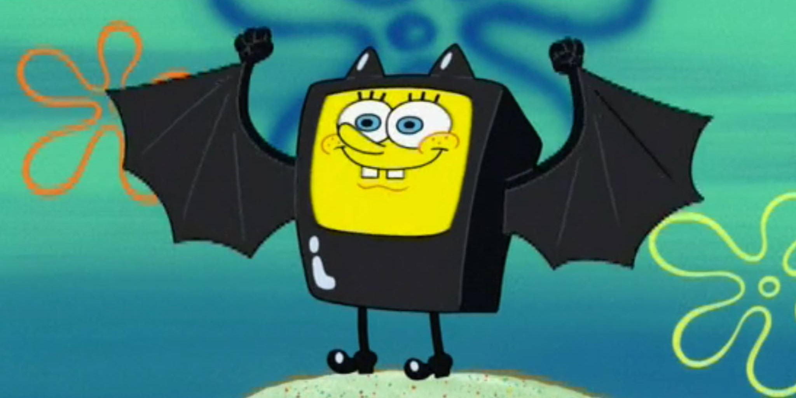

<h1 align="center">Hi there! Welcome to my profile ʕ•́ᴥ•̀ʔっ♡ </h1>

  

## About me
### I'm Earn👋
- 🎓 New grad from Computer Engineering student at Chulalongkorn University (CU104/CP47)
- 📫 Contact: watcharavit.v@hotmail.com

## Languages & Tools:

### Fundamental

  
  
  
  
  

### Web Development

  
  
  
  
  
   
  
   
  
  
  

### Interest

  
  
  

## GitHub
<picture>
  <source media="(prefers-color-scheme: dark)" srcset="https://raw.githubusercontent.com/Watcharavit/Watcharavit/output/github-contribution-grid-snake-dark.svg">
  <source media="(prefers-color-scheme: light)" srcset="https://raw.githubusercontent.com/Watcharavit/Watcharavit/output/github-contribution-grid-snake.svg">
  
</picture>

<!--
**Watcharavit/Watcharavit** is a ✨ _special_ ✨ repository because its `README.md` (this file) appears on your GitHub profile.
-->
